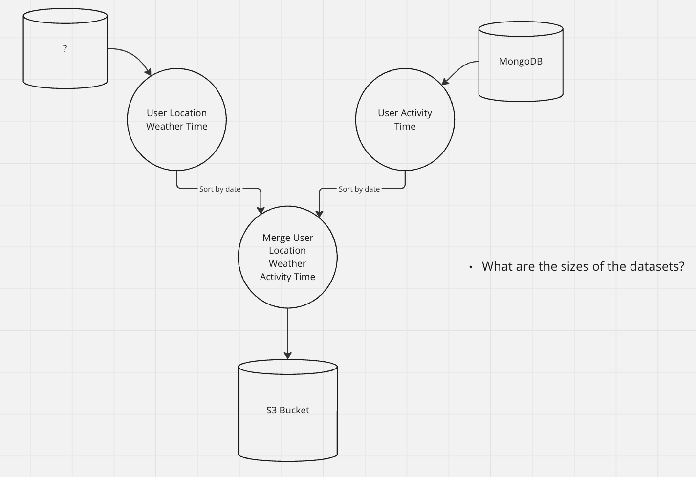

# Getting Started

## Task

[sketching/designing] Imagine we sit together with the engineer team and you want to communicate an idea 
for how we could create a weekly dataset for the ML team that they can use to train a model 
to predict which activity users like to do in which locations and weather conditions based on 
the history of these data of the last week.

Design a simple system design sketch (any whiteboard, sketch tool or photo of hand drawn is fine)

So this flow needs to include:

* export all user's weather and location data (e.g. from the service from task 1) once a week
* merge it with a data export from another microservice.
This second service uses a MongoDB that stores all user's activities (e.g. when they went for a run) with timestamps
* write a merged dataset to S3 ( for the ML Team to consume as a training dataset).

The sketch does not need to be very perfect, complete or self-explanatory. 
We will discuss it in our session as if it was a small team internal planning session

## Solution

